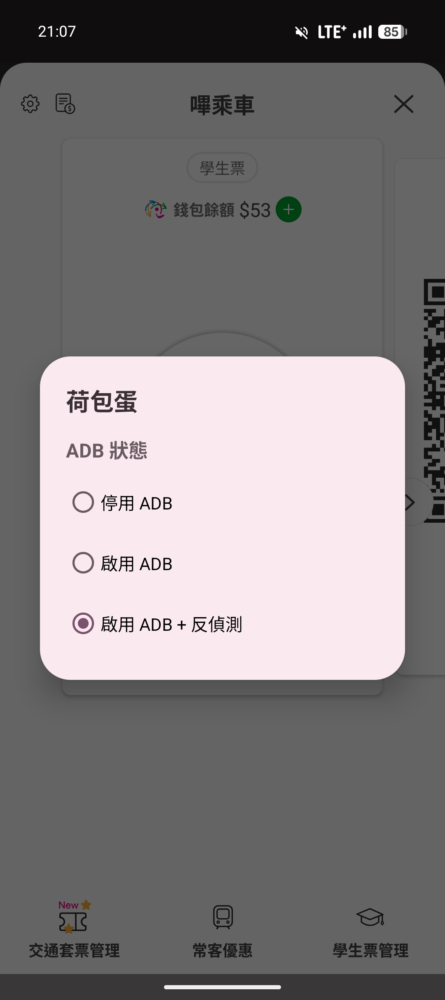

# 荷包蛋

[English README](README.md)

一個極簡且極輕量的 Android App (約 61 KB)，用來快速切換 adb_enabled，以繞過金融 APP 的偵錯偵測。

| 應用程式介面 | 快速設定面板 |
| :---: | :---: |
|  |  |

## 原理

許多金融與銀行 APP 透過 Settings.Global.ADB_ENABLED == 1 偵測 USB 偵錯模式。將值設為 2，這些簡單的相等檢查就會失敗，APP 認為 ADB 已關閉，但 Android 系統仍將非零值視為啟用。

荷包蛋 (HDB) 提供最簡單原生的方式來切換此狀態。

## 功能

- 快速設定面板 (Quick Settings Tile): 支援在狀態列下拉選單中直接切換狀態
- 可自訂數值: 可選擇 0、1 或 2
- 純原生 UI: 無多餘的 Material 或 AppCompat 依賴，APK 體積縮減至 ~61 KB
- 多語言支援: 英文及繁體中文

## 安裝步驟

### 1. 建構

需要 Java 17 及 Android SDK。

```bash
./gradlew assembleRelease
```

### 2. 安裝

```bash
adb install app/build/outputs/apk/release/app-release.apk
```

### 3. 授權

WRITE_SECURE_SETTINGS 無法透過一般安裝取得，必須透過 ADB 授權 (一次性):

```bash
adb shell pm grant dev.e88e89.hdb android.permission.WRITE_SECURE_SETTINGS
```


## 繞過原理

| adb_enabled | ADB 可用 | 金融 APP 偵測 |
|:-:|:-:|:-:|
| 0 | 否 | 通過 (ADB 關閉) |
| 1 | 是 | 被偵測 |
| 2 | 是 | 通過 (≠ 1) |

## 相容性

以 adb_enabled = 2 測試:

| APP | 狀態 | 備註 |
|---|:-:|---|
| iPASS MONEY (一卡通) | 通過 | |
| 全支付 | 通過 | |
| 悠遊付 (Easy Wallet) | 通過 | |
| 台北富邦銀行 | 通過 | |
| 富邦 AI Pro | 通過 | |
| 行動郵局 | 通過 | |
| 街口支付 | 通過 | |
| 國泰世華 | 通過 | |
| 中國信託 | 通過 | |
| OPEN POINT | 通過 | |
| 國泰證券 | 警告 | 會顯示警告，但不影響使用 |
| 將來銀行 | 警告 | 轉帳功能受限 |
| 全家便利商店 | 阻擋 | 拒絕啟動 |

注意: 使用更進階偵測方式的 APP (如檢查 USB 連線狀態、ro.debuggable 或使用 attestation API) 可能仍會偵測到偵錯模式，不受 adb_enabled 值影響。

## 授權條款

本專案採用 GNU General Public License v3.0 授權。
